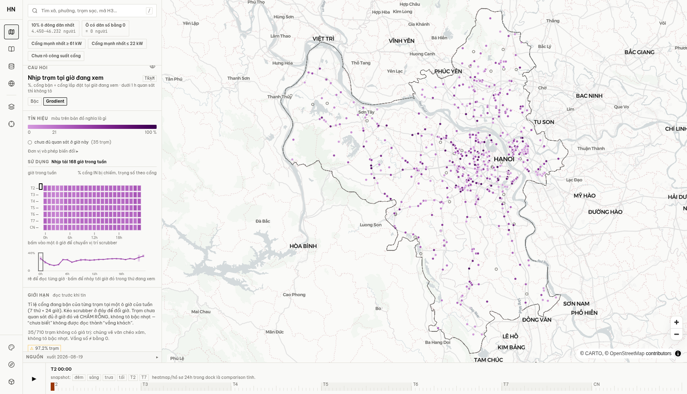
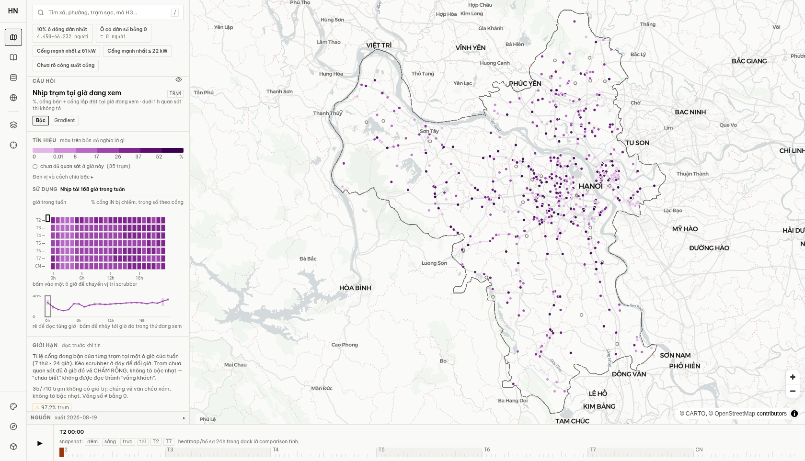
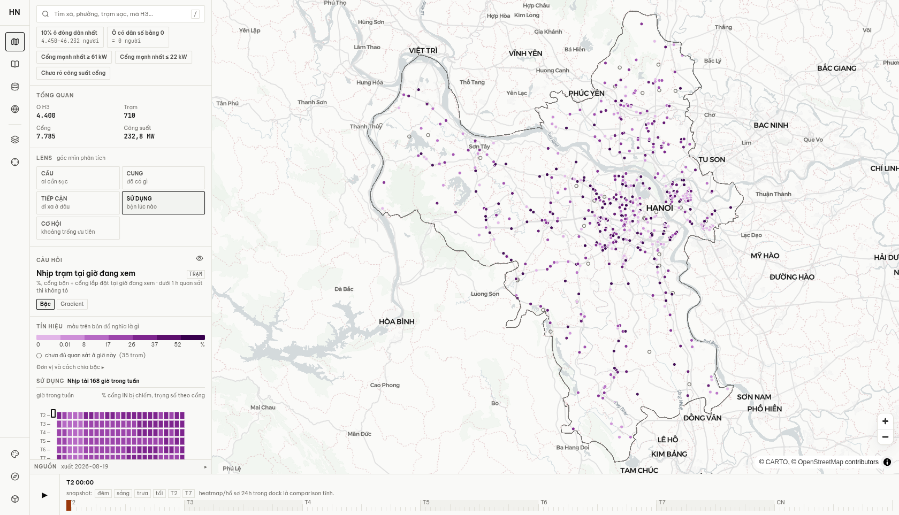
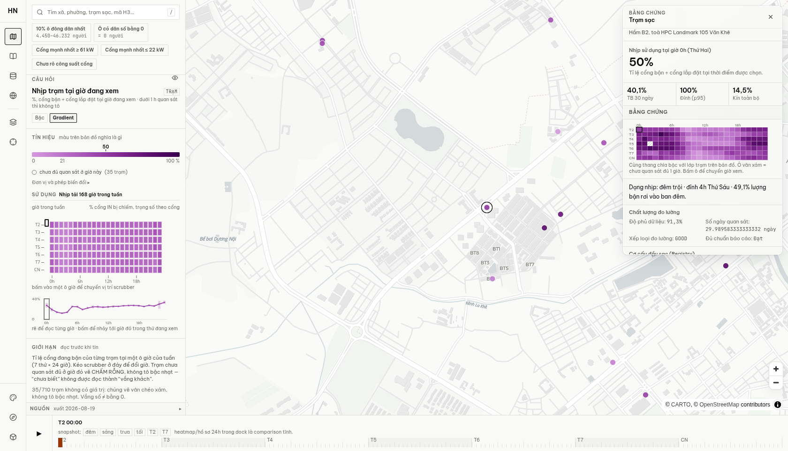
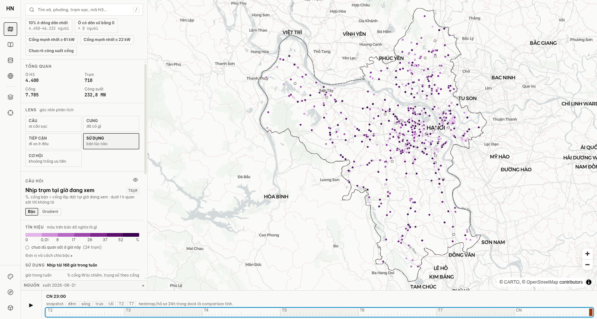

# Spec trực quan hóa lens “Sử dụng”

**Trạng thái:** implementation-ready · **Ngày audit:** 2026-08-21 · **Phạm vi:** desktop

Tài liệu này là đặc tả thiết kế và kỹ thuật. Nó không triển khai visualization, không sửa
code sản phẩm và không định nghĩa một ngưỡng nghiệp vụ mới.

## 1. Executive decision

1. **Thời gian:** thay cặp `Heatmap168 + HourProfile` ở biểu đồ chính bằng **7 hồ sơ ngày
   xếp dọc**, mỗi hàng là 24 ô giờ dạng step-line, dùng cùng trục tuyệt đối 0–100%. Giá trị
   vẫn là `Σocc / Σn_ports`; vị trí, không phải màu, là kênh định lượng chính. Bảy hàng dùng
   chung trục giờ để nhìn được peak/trough và so sánh cùng giờ giữa các ngày.
2. **Không gian:** thêm chế độ overview mặc định **“Vùng tải”** bằng H3 đa mức phân giải.
   Fill của mỗi vùng biểu diễn đúng `Σocc / Σn_ports` trên các trạm IN đủ quan sát tại giờ
   đang chọn. Khi zoom sâu hoặc drill-down, chuyển sang điểm trạm và Inspector hiện có.
3. **Tổng tải:** không đưa heat/contour surface vào bản đầu. Nếu bổ sung sau này, surface chỉ
   được cộng `Σocc`, tên là **“Cổng đang bận (quan sát)”** hoặc **“Tải quan sát”**; không dùng
   utilization rate làm weight và không trộn tổng số với tỷ lệ trong cùng một hue.
4. **Ngôn ngữ:** không dùng “quá tải”, “thiếu năng lực” hay “đủ năng lực”. Màu đậm chỉ có
   nghĩa **tỷ lệ cổng bận cao hơn**. Ngưỡng screening 40% không phải ngưỡng quá tải.
5. **Múi giờ:** ba manifest được audit đều chưa có `snapshots.occupancy_hour_tz`. Cho tới khi
   field này được công bố, UI chỉ được gọi `0…23` là **ô giờ của dữ liệu**, không gọi là giờ
   địa phương và không suy ra timezone từ cửa sổ UTC.
6. **Mobile:** theo scope cập nhật của chủ dự án, không audit, không chụp, không thiết kế và
   không thay đổi mobile trong công việc này. Spec không có mobile wireframe.

## 2. Facts, inferences và decisions

| Loại | Phát biểu | Bằng chứng / hệ quả |
|---|---|---|
| Fact | `occ` là số cổng bận trung bình, không phải tỷ lệ. | `docs/COT.md`; `web/src/viz/occ.ts:37-39`. |
| Fact | Một station-hour chỉ được gộp khi trạm là IN và `stationOccAt()` trả khác `null`; hàm này gate `n_ports > 0`, `observed_h >= 1`, `occ` hữu hạn. | `web/src/viz/occ.ts:67-75`; BUFFER không được gộp. |
| Fact | Aggregate hiện tại là ratio-of-sums, không phải average-of-rates. | `cityProfile()` và `buildUtilizationWeekHeatmap()`; test fixture 100 cổng + 2 cổng. |
| Fact | Heatmap và điểm trạm hiện dùng chung scale tính trên mọi station-hour của cả tuần; scale không đổi khi scrub. | `web/src/App.tsx:299-323`; Phase 4.1 test. |
| Fact | Hà Nội có 168 aggregate hợp lệ, trough 11,01%, peak 36,18%, biên độ 25,18 điểm %, tỷ số 3,29×. | Audit package `p/01`; khớp report Phase 4.1. |
| Fact | Heatmap aggregate Hà Nội chỉ rơi vào 3/7 class hiện tại, dù điểm trạm có đủ 7 class ở cả 168 giờ. | Audit Parquet + thuật toán `computeClassing()`. |
| Fact | Khác biệt trung bình ngày của Hà Nội nhỏ: daily mean 22,90–25,22%, biên độ 2,33 điểm %. | Audit 7 profile ngày. |
| Fact | Point overlap rất cao ở overview Hà Nội: 98,45% trạm có ít nhất một điểm chồng ở z8, 72,68% ở z10. | Phép đo Web Mercator với đúng bán kính hiện tại. |
| Fact | Manifest `p/01`, `p/68`, `p/11` không có `occupancy_hour_tz`. | Đọc trực tiếp `manifest.json`. |
| Fact | Điện Biên có cờ `KHONG_DO_DUOC_SU_DUNG` và 0% trạm đạt quality gate dù file profile còn raw rows. | `p/11/manifest.json`; package-level gate phải thắng raw cell. |
| Inference | Heatmap đồng màu do **cả dữ liệu lẫn encoding**: các ngày thực sự khá giống nhau, nhưng nhịp trong ngày có thật đang bị domain 0–100% nén. | Daily-mean range 2,33 điểm %; trough→peak 25,18 điểm %; gradient trough→peak chỉ ΔE 13,08. |
| Inference | Point fill riêng lẻ không trả lời tốt “tải tập trung ở đâu” tại overview vì occlusion phụ thuộc mật độ và zoom. | Tỷ lệ chồng điểm và bán kính cố định; không có phép gộp vùng. |
| Decision | Dùng position với shared 0–100% axis cho thời gian. | Không phụ thuộc riêng hue, không đổi nghĩa theo scrub, giữ zero baseline. |
| Decision | Dùng H3 ratio-of-sums cho overview; station point cho drill-down. | Giữ đúng tử số/mẫu số, giảm occlusion, vẫn truy về trạm. |
| Decision | Không claim overload. | Không có queue/wait/SLA/threshold theo giờ và khu vực. |

## 3. Baseline screenshots

Các ảnh dưới đây là baseline desktop production build ngày 2026-08-20, Chromium headless,
`devicePixelRatio=1`. Report Phase 4.1 đo pixel render thật, không gọi lại hàm màu. Không mở
hoặc tạo baseline mobile theo scope cập nhật.

### 3.1 Gradient 0–100% hiện tại



- 168 cell aggregate nằm trong 11,0–36,2% của scale `[0,1]`.
- Sai khác giữa pixel render và màu kỳ vọng có ΔE tối đa 0,636: renderer đang vẽ đúng scale;
  đây không phải lỗi CSS hoặc lệch legend.
- Audit trực tiếp `colorFor()` cho Hà Nội: trough 11,01% là gần `#c784d2`, peak 36,18% gần
  `#a654b5`; ΔE trough→peak chỉ **13,08** trên toàn hình.

### 3.2 Binned hiện tại



- Heatmap aggregate chỉ dùng 3 class: c3 22 giờ, c4 88 giờ, c5 58 giờ.
- Ba màu render là `#b669c4`, `#9c45ab`, `#7e258e`; ΔE c3→c4 = 9,80 và c4→c5 = 9,58.
- Scale toàn station-hour vẫn có đủ 7 class; vấn đề là population của aggregate hẹp hơn
  population dùng để dựng scale.

### 3.3 Điểm trạm hiện tại



- Radius chỉ phụ thuộc zoom: 3 px ở z≤10, 4,5 px ở z11, 6 px ở z≥12.
- Fill là utilization; radius không mang số cổng hoặc số cổng bận.
- Điểm hợp lệ được vẽ sau điểm null nên ở cụm dày, điểm trên cùng có thể che nhiều trạm khác.

### 3.4 Null ở station inspector và scrubber



Pixel hatch hợp thành khác ô gradient nhạt nhất ΔE 19,45, nên null hiện phân biệt được với
zero/low utilization. Contract này phải được giữ.



Scrubber đã có slider semantics, phím `←/→`, `PageUp/PageDown`, `Home/End`, playback 4 Hz và
không query DuckDB. Vấn đề còn lại là copy đang in `T2 08:00` như clock time trong khi
manifest chưa công bố timezone.

## 4. Data audit

### 4.1 Phương pháp

- Nguồn: `web/public/data/p/{01,68,11}`; file `stations.parquet`,
  `station_occupancy_profile_168h.parquet`, `manifest.json`.
- Join bằng `station_code`; chỉ `scope == "IN"`.
- Gate audit phản chiếu `stationOccAt()`: `n_ports` hữu hạn và >0, `observed_h >= 1`, `occ`
  hữu hạn. Null không được đổi thành 0.
- Aggregate tại `t = dow * 24 + hour` là `Σocc / Σn_ports` trên chính tập đủ gate.
- Break dùng đúng thuật toán hiện tại: nếu zero ≥5%, zero là class riêng; sáu class dương là
  quantile trên toàn bộ station-hour hợp lệ của package.
- Point overlap: chiếu Web Mercator, một cặp bị tính chồng khi khoảng cách tâm nhỏ hơn hai
  lần `stationFieldRadius(zoom)`. Đây là phép đo hình học 2D, chưa mô phỏng pitch/picking.
- `p/68` (Lâm Đồng) là đối chứng có phân phối thấp/hẹp khác Hà Nội. `p/11` (Điện Biên) là
  package bị vô hiệu hóa có sẵn local; các số raw của nó chỉ phục vụ diagnosis, **không được
  dùng để bật visualization**.

### 4.2 Tổng quan package

| Chỉ số | p/01 Hà Nội | p/68 Lâm Đồng | p/11 Điện Biên |
|---|---:|---:|---:|
| Occupancy usable | Có | Có | **Không** |
| Manifest station coverage | 95,21% | 91,98% | 0% |
| Trạm IN | 710 | 237 | 39 |
| Cổng IN biết `n_ports` | 7.785 | 2.358 | 209 |
| Trạm khuyết `n_ports` | 19 | 1 | 1 |
| Station-hour qua gate | 112.843 | 36.048 | 2.397 raw diagnostic |
| Station-hour zero | 15,49% | 18,03% | 39,59% raw diagnostic |
| `occupancy_hour_tz` | Vắng | Vắng | Vắng |

Điện Biên có 47/168 giờ không một trạm raw nào qua observed-hour gate, và 121 giờ còn lại
cũng không cứu được package: quality gate 30 ngày đánh dấu 0% trạm usable. UI phải dừng ở
package gate và hiện lý do, không “vớt” các giờ raw trông có vẻ hợp lệ.

### 4.3 Phân phối `stationOccAt()`

Các quantile dưới đây theo thứ tự min / p25 / median / p75 / p90 / max.

| Package | Station utilization | `n_ports` / trạm | `occ` cổng bận trung bình |
|---|---|---|---|
| p/01 | 0 / 6,09% / 20,53% / 39,58% / 60,42% / 100% | 1 / 3 / 6 / 10,5 / 24 / 256 | 0 / 0,25 / 1,06 / 2,96 / 6,83 / 103,17 |
| p/68 | 0 / 1,39% / 6,94% / 17,31% / 30,56% / 100% | 1 / 4 / 6 / 12 / 20 / 72 | 0 / 0,13 / 0,48 / 1,15 / 2,23 / 12,02 |
| p/11 raw | 0 / 0 / 4,76% / 16,67% / 29,36% / 90,48% | 1 / 3 / 4 / 6 / 9,2 / 24 | 0 / 0 / 0,23 / 0,86 / 2,20 / 7,93 |

`occ` có thể là số lẻ vì nó là **trung bình của số cổng bận** trong bucket nguồn, không phải
snapshot đếm tức thời. Tooltip không được làm tròn nó thành một count nguyên giả.

### 4.4 Peak, trough và khác biệt ngày

| Package | Trough | Peak | Dynamic range | Peak/trough |
|---|---:|---:|---:|---:|
| p/01 | 11,01% tại `t=51` | 36,18% tại `t=167` | 25,18 điểm % | 3,29× |
| p/68 | 2,28% tại `t=27` | 13,89% tại `t=159` | 11,61 điểm % | 6,10× |
| p/11 raw | 0% tại `t=31` | 50% tại `t=108` | 50 điểm % | không xác định |

Chi tiết Hà Nội theo `dow=0…6`:

| dow | Min | Max | Mean | Ô giờ peak |
|---:|---:|---:|---:|---:|
| 0 | 12,97% | 35,15% | 25,22% | 22 |
| 1 | 11,25% | 35,60% | 23,50% | 22 |
| 2 | 11,01% | 33,80% | 23,20% | 22 |
| 3 | 11,03% | 35,06% | 22,90% | 22 |
| 4 | 11,35% | 35,36% | 23,68% | 23 |
| 5 | 13,22% | 34,56% | 24,16% | 23 |
| 6 | 12,70% | 36,18% | 23,44% | 23 |

Daily mean chỉ trải 2,33 điểm %. Median của chênh lệch max–min giữa 7 ngày tại cùng một giờ
là 3,39 điểm %. Do đó hàng ngày nhìn giống nhau một phần là thuộc tính thật của dữ liệu;
ngược lại, biến thiên trong ngày 25,18 điểm % là đủ lớn để visualization phải làm lộ ra.

Không đổi `t` thành nhãn clock trong các bảng sản phẩm cho tới khi timezone được công bố.
`t` ở đây là chỉ số dữ liệu để audit.

### 4.5 Break, class thực sự xuất hiện và contrast

**Hà Nội — break hiện tại:**

`0 · 0,0149% · 8,3333% · 16,6667% · 25,8333% · 36,8056% · 52,4306%`

| Class | Station-hour | Tỷ trọng tuần | Aggregate heatmap |
|---:|---:|---:|---:|
| c1 | 17.483 | 15,49% | 0 giờ |
| c2 | 15.080 | 13,36% | 0 giờ |
| c3 | 16.691 | 14,79% | 22 giờ |
| c4 | 15.855 | 14,05% | 88 giờ |
| c5 | 15.921 | 14,11% | 58 giờ |
| c6 | 15.892 | 14,08% | 0 giờ |
| c7 | 15.921 | 14,11% | 0 giờ |

- Bản đồ station-level có đủ **7 class tại từng giờ trong cả 168 giờ**.
- Aggregate heatmap chỉ có **3 class trong cả tuần**.
- Binned colors dùng thực tế có contrast với nền positron lần lượt 3,25:1, 4,89:1, 7,42:1.
- Gradient `[0,1]` tại 11,01%, 16,67%, 25,83%, 36,18% có ΔE từng đoạn lần lượt
  3,07 · 4,71 · 5,32; tổng trough→peak 13,08. Đây là tương phản thấp cho 168 ô nhỏ dù màu
  render đúng registry.

**Lâm Đồng — break hiện tại:**

`0 · 0,0365% · 2,6042% · 5,5556% · 10% · 15,9649% · 26,0417%`

Aggregate dùng 4 class dương: c2 7 giờ, c3 33 giờ, c4 62 giờ, c5 66 giờ. Trạm-level vẫn có
đủ 7 class ở từng giờ. Sự khác nhau giữa hai package chứng minh một scale quantile theo
package không có ý nghĩa tuyệt đối xuyên tỉnh, dù nó đứng yên trong một phiên.

### 4.6 Coverage theo giờ

Quantile theo thứ tự min / p25 / median / p75 / p90 / max.

| Chỉ số | p/01 Hà Nội | p/68 Lâm Đồng |
|---|---|---|
| Trạm đóng góp | 522 / 679 / 685 / 687 / 687 / 690 | 93 / 213 / 231 / 232 / 232 / 232 |
| Trạm thiếu | 20 / 23 / 25 / 31 / 79 / 188 | 5 / 5 / 6 / 24 / 77 / 144 |
| Coverage theo trạm | 73,52% / 95,60% / 96,48% / 96,76% / 96,76% / 97,18% | 39,24% / 89,87% / 97,47% / 97,89% / 97,89% / 97,89% |
| Cổng đóng góp | 6.342 / 7.704 / 7.765 / 7.768 / 7.769 / 7.775 | 957 / 2.146 / 2.287 / 2.290 / 2.290 / 2.290 |
| Coverage theo cổng | 81,46% / 98,95% / 99,74% / 99,78% / 99,79% / 99,87% | 40,59% / 91,00% / 96,99% / 97,12% / 97,12% / 97,12% |
| observed hour/cổng | 2,55 / 3,85 / 3,93 / 4,04 / 4,91 / 4,94 | 0,81 / 2,80 / 3,60 / 3,79 / 4,38 / 4,68 |

Coverage theo trạm và theo cổng trả lời hai câu khác nhau; cả hai phải có mặt trong model.
Không được chỉ hiện badge phủ cả tuần 690/710 rồi ngụ ý mọi giờ đều có 690 trạm.

### 4.7 Average-of-rates so với ratio-of-sums

| Package | Mean `average(rate) - ratio(sum)` | Mean absolute | Max absolute | Ví dụ max (`average` vs `ratio`) |
|---|---:|---:|---:|---:|
| p/01 | +1,75 điểm % | 1,81 điểm % | 4,18 điểm % tại `t=92` | 30,37% vs 26,19% |
| p/68 | +2,91 điểm % | 2,91 điểm % | 4,45 điểm % tại `t=157` | 17,82% vs 13,37% |
| p/11 raw | −0,73 điểm % | 1,60 điểm % | 13,74 điểm % tại `t=94` | 28,16% vs 41,90% |

Sai khác có thể đổi cả độ lớn lẫn dấu. Phương án cuối bắt buộc ratio-of-sums; không có
fallback sang average-of-rates.

### 4.8 Mật độ điểm và LOD

| Zoom | Radius hiện tại | Hà Nội: trạm bị chồng | Lâm Đồng: trạm bị chồng |
|---:|---:|---:|---:|
| 8 | 3 px | 699/710 = 98,45% | 178/237 = 75,11% |
| 10 | 3 px | 516/710 = 72,68% | 74/237 = 31,22% |
| 11 | 4,5 px | 465/710 = 65,49% | 59/237 = 24,89% |
| 12 | 6 px | 375/710 = 52,82% | 38/237 = 16,03% |
| 13 | 6 px | 265/710 = 37,32% | 21/237 = 8,86% |

| H3 resolution | Hà Nội: số cell / median / max trạm | Lâm Đồng: số cell / median / max trạm |
|---:|---:|---:|
| r6 | 88 / 4 / 51 | 116 / 1 / 15 |
| r7 | 266 / 2 / 20 | 173 / 1 / 5 |
| r8 | 449 / 1 / 13 | 214 / 1 / 4 |

H3 không làm dữ liệu “đúng hơn”; nó làm rõ đơn vị đọc ở overview và giảm occlusion. Tooltip
phải nói resolution, số trạm và số cổng để một cell 1 trạm không bị đọc như một vùng ổn định.

## 5. User jobs

1. Tìm ô giờ mạng lưới bận hơn hoặc ít bận hơn mà không phải giải mã hue tinh tế.
2. So sánh cùng một giờ giữa bảy ngày và thấy ngày nào lệch khỏi nhịp chung.
3. Xác định vùng nào có tỷ lệ cổng bận cao hơn ở giờ đang chọn.
4. Phân biệt rõ **tỷ lệ cổng bận** (`Σocc/Σn_ports`) với **số cổng bận trung bình** (`Σocc`).
5. Biết bao nhiêu trạm/cổng đóng góp, bao nhiêu bị thiếu và coverage của giờ/vùng đang đọc.
6. Biết dữ liệu chỉ mô tả utilization/tải quan sát, chưa chứng minh “quá tải”.

## 6. Non-goals

- Không thiết kế hoặc thay đổi mobile.
- Không suy ra queue, thời gian chờ, SLA, nhu cầu bị từ chối hoặc capacity shortage.
- Không dùng 40% của screening làm ngưỡng utilization hay overload.
- Không tạo composite score không có định nghĩa nghiệp vụ.
- Không cộng phần trăm utilization để làm heat surface.
- Không đưa BUFFER vào bất kỳ aggregate lens nào.
- Không đổi scale theo `t`, hover, selection hoặc viewport.
- Không query DuckDB khi scrub/play/chọn giờ.
- Không dùng blinking; không auto-start playback.
- Không làm contour `Σocc` trong implementation đầu tiên.

## 7. Occupancy semantic contract

### 7.1 Station-hour hợp lệ

Mọi consumer phải đi qua một helper duy nhất gọi trực tiếp `stationOccAt()`:

```ts
type EligibleStationHour = {
  rate: number;       // stationOccAt(p, s, t) = occ / n_ports
  occ: number;        // cổng bận trung bình, raw additive numerator
  ports: number;      // n_ports đã lắp
  observedH: number;
};

function eligibleStationHour(p, s, t): EligibleStationHour | null {
  if (!p.inScope[s]) return null;
  const rate = stationOccAt(p, s, t);
  if (rate === null) return null;
  const i = s * 168 + t;
  return { rate, occ: p.occ[i], ports: p.nPorts[s], observedH: p.observed[i] };
}
```

Không được chép lại các điều kiện `observed_h`, `n_ports`, finite/null ở
`chart-models.ts`, layer H3 hoặc tooltip. `buildUtilizationWeekHeatmap()` hiện chép gate;
implementation phải hợp nhất nó với helper này.

### 7.2 Aggregate tỉnh/ngày/vùng

Với tập trạm không gian `S_g` và giờ `t`:

```text
E(g,t) = { s ∈ S_g | s.scope = IN ∧ eligibleStationHour(s,t) ≠ null }

busy_ports_avg(g,t) = Σ[s∈E(g,t)] occ(s,t)
observed_ports(g,t) = Σ[s∈E(g,t)] n_ports(s)
utilization(g,t) = busy_ports_avg(g,t) / observed_ports(g,t)
```

Nếu `observed_ports == 0`, utilization là `null`, không phải 0. Không lấy
`mean(stationOccAt(...))`.

### 7.3 Coverage

```text
all_installed_ports(g) = Σ[s∈S_g, finite n_ports>0] n_ports(s)
all_stations(g) = count(s∈S_g, scope=IN)

port_coverage(g,t) = observed_ports(g,t) / all_installed_ports(g)
station_coverage(g,t) = |E(g,t)| / all_stations(g)

port_weighted_observed_h(g,t)
  = Σ[s∈S_g, finite n_ports>0] observed_h(s,t) * n_ports(s)
    / all_installed_ports(g)
```

`observed_h` thiếu đóng góp 0 vào tử số cuối, không loại cổng khỏi mẫu số coverage. Các mẫu
số phải được khai trong tooltip; không dùng từ “coverage” một mình.

### 7.4 Package gate

Nếu manifest đánh dấu occupancy unusable, toàn lens visualization nhận `disabledReason` và
không dựng temporal profile, H3 fill hoặc station utilization points. File raw có row không
được phép vượt package gate.

## 8. Temporal visualization decision matrix

Điểm: 1 kém, 3 chấp nhận được, 5 tốt. “Mobile” không được chấm do ngoài scope.

| Tiêu chí | A. Heatmap fixed scale cải thiện | B. 7×24 small-multiple step-lines | C. Một line 168 giờ |
|---|---:|---:|---:|
| Peak/trough detection | 2 | **5** | 4 |
| Day-to-day comparison | 3 | **5** | 2 |
| Không phụ thuộc riêng màu | 2 | **5** | 5 |
| Chọn đúng `t` | 5 | **5** | 4 |
| Keyboard | 4 | **5** | 4 |
| Missing data | 4 | **5** | 4 |
| Vừa cột 320–340 px | 5 | **4** | 5 |
| Complexity | 5 | 4 | **5** |
| Tick performance | 5 | **5** | 5 |
| Tổng | 30 | **43** | 34 |

### A. Heatmap fixed scale cải thiện

- Giữ 7×24 cell, domain cố định cả tuần; có thể thêm direct labels/outline và legend giải
  thích actual range.
- Ưu: compact, hit target 168 cell đã có, null hatch tốt, dễ giữ story layout.
- Nhược: aggregate vẫn chỉ chiếm một đoạn nhỏ của scale station-hour; binned chỉ có 3 màu,
  gradient trough→peak ΔE 13,08; vẫn dựa chủ yếu vào hue.
- Không chọn làm primary. Có thể tồn tại tạm trong migration hoặc MiniHeatmap station-level.

### B. Small multiples 7 ngày × 24 giờ — **chọn**

- Bảy hàng có cùng x=0…23 và y=0…100%; một hàng tương ứng một `dow`.
- Mark là **step-line theo bucket giờ**, không nội suy spline và không area fill. Khoảng trống
  là null. Điểm/segment tại giờ đang chọn có casing đen và shape, không chỉ đổi màu.
- Một guide dọc tại `hourOf(t)` chạy qua cả bảy hàng; hàng `dowOf(t)` có outline chọn. Nhờ đó
  người dùng vừa thấy cùng giờ giữa ngày, vừa biết cell toàn cục đang điều khiển bản đồ.
- Trục y không autoscale theo package. Hà Nội 11→36% chiếm đúng 25% chiều cao; Lâm Đồng
  2→14% chiếm 12%, trung thực hơn việc stretch cả hai thành full height.

### C. Một line 168 giờ trong 320–340 px

- Chung trục 0–100%, vạch phân ngày mỗi 24 giờ, step-line liên tục.
- Tốt cho chronology và compact, nhưng mỗi giờ chỉ khoảng 1,6 px; so cùng giờ giữa các ngày
  buộc mắt tự căn bảy đoạn, keyboard hit target khó hơn.
- Không chọn.

## 9. Temporal component contract

Component đề xuất: `UtilizationDayProfiles`.

### 9.1 Geometry

- Outer width lấy từ container; target content width 296–316 px trong rail 320–340 px.
- Left margin 28 px; right 4 px; plot có 24 equal-width columns.
- Bảy rows, plot height 24 px/row, gap 4 px; tổng chart tối đa 224 px kể cả axis/readout.
- Shared y-domain `[0,1]`; grid tại 0%, 50%, 100%. Row labels dùng `DOW_LABELS` khi mapping
  thứ đã được xác nhận; time copy vẫn thêm “múi giờ chưa công bố”.
- Step segment của bucket `h` phủ `[h,h+1)`. Không nối qua null.

### 9.2 Readout

Hover/focus một cell hiển thị:

```text
Thứ Ba · ô giờ 18 · 26,2% cổng bận
1.943,6 / 7.421 cổng · 681/710 trạm
coverage cổng 95,3% · 3,9 giờ quan sát/cổng
Múi giờ của profile chưa được công bố
```

Số minh họa phải lấy từ model, không hard-code. Dòng đầu dùng “ô giờ” khi timezone vắng.

### 9.3 Missing

- Aggregate `null`: line bị ngắt đúng một bucket; bucket có hatch/`×` trung tính và label AT
  “chưa đủ quan sát”, không rơi về baseline 0.
- Aggregate có giá trị nhưng coverage thấp vẫn vẽ giá trị; readout luôn kèm coverage.
- Không invent threshold để xóa một aggregate đã qua station gate.

### 9.4 Keyboard và pointer

- Một Tab vào chart, roving active cell là `t` hiện tại.
- `←/→`: `t ± 1`, wrap trong 0…167.
- `↑/↓` và `PageUp/PageDown`: cùng hour ở ngày trước/sau (`t ± 24`), wrap 7 ngày.
- `Home`: 0; `End`: 167. Phím lạ không `preventDefault`; Tab thoát được.
- Arrow thay `t` ngay như scrubber hiện tại. Hover chỉ preview readout, không thay global `t`;
  click/Enter/Space commit `TimeCursorSet`.
- Mỗi accessible name chứa day index/name, hour bucket, value/null và coverage ngắn.

## 10. Spatial visualization decision matrix

### 10.1 So sánh

| Tiêu chí | A. Điểm/proportional symbol | B. H3/grid ratio-of-sums | C. Heat/contour additive |
|---|---|---|---|
| Câu hỏi chính | Trạm nào bận hơn? | **Vùng nào có tỷ lệ cổng bận cao hơn?** | Tổng cổng bận quan sát tập trung ở đâu? |
| Tử số | `occ_s,t` | `Σocc_s,t` | `Σocc_s,t` |
| Mẫu số | `n_ports_s` | `Σn_ports_s` của trạm đủ gate | Không có; đơn vị là cổng bận TB |
| Fill | utilization station | **utilization vùng** | intensity của tổng additive |
| Radius | Fixed, hoặc area∝`n_ports` nếu chọn proportional | Không dùng | Kernel bandwidth, không phải dữ liệu |
| Height | Không | Không | Không trong bản đầu |
| Outline | Null/status/selection | **coverage warning/selection** | Boundary/coverage disclosure |
| Ảnh hưởng mật độ | Occlusion nặng; z8 HN 98,45% chồng | Cell count/resolution được khai | Smoothing có thể tạo hotspot giữa trạm |
| Resolution | Point, phụ thuộc zoom bằng radius | **r6/r7/r8 cố định theo zoom bands** | Pixel/kernel meters phải công bố |
| Coverage/null | Hollow point | Null cell + exact station/port coverage | Khó biểu đạt coverage dưới surface |
| Tooltip | Trạm, `occ/n_ports`, coverage | **x/y cổng · n/N trạm · coverage** | Tổng `Σocc`, contributors, bandwidth |
| Selection | Station Inspector | **Chọn H3 → list/zoom → station Inspector** | Pixel không phải entity tốt để select |
| Legend | Ratio | **Ratio, fixed absolute** | Cổng bận TB, tuyệt đối |
| Performance | O(N) point draw/tick | Precompute membership; O(cells) update | GPU aggregate, nhạy bandwidth/zoom |
| Có gọi “quá tải”? | Không | **Không** | Không |
| Kết luận | Giữ cho drill-down | **Chọn cho overview** | Chỉ là future secondary surface |

### 10.2 A. Station points/proportional symbols

- Nếu fill=rate và area=`n_ports`, symbol đồng thời nói tỷ lệ và capacity, nhưng overlap tăng
  đúng nơi nhiều trạm/cổng. Nếu area=`occ`, người xem khó phân biệt total với rate.
- Phương án cuối giữ radius cố định ở station drill-down; `n_ports` và `occ` đi vào tooltip,
  không thêm channel area mặc định.
- Hollow point tiếp tục là null. Điểm được phép chọn dù null để mở Inspector.

### 10.3 B. H3/grid aggregation — **chọn**

- Một cell là vùng thống kê, không phải “khu vực kinh doanh” hay địa giới hành chính.
- Fill hue/lightness chỉ mã hóa `Σocc/Σn_ports`.
- Không dùng radius hoặc height. Outline đen/trắng hai pass dành cho selection; outline dashed
  dành cho coverage theo cổng <50%, tái sử dụng ngưỡng data-health hiện có chỉ như cảnh báo
  **“coverage thấp”**, không gọi ≥50% là “đủ”. Exact coverage luôn nằm trong tooltip.
- Một cell có 1 trạm vẫn vẽ; tooltip phải khai `1 trạm` để người dùng tự đánh giá độ ổn định.

### 10.4 C. Contour/heat surface của đại lượng cộng được

- Chỉ hợp lệ khi weight từng trạm là raw `occ_s,t`; phép GPU aggregation là sum.
- Tên legend: `Cổng đang bận trung bình (quan sát)`, không phải `%`, “áp lực” hay “quá tải”.
- Phải công bố kernel/bandwidth theo mét và giữ nó ổn định trong từng zoom band; không để
  zoom tự đổi ý nghĩa mà legend không đổi.
- Raw utilization rate tuyệt đối không được truyền vào `HeatmapLayer.getWeight`.
- Không chọn trong bản đầu vì surface che coverage, tạo hotspot phụ thuộc smoothing và không
  có entity rõ cho drill-down.

## 11. Phương án không gian cuối

### 11.1 Representation và LOD

Lens Sử dụng có segmented control desktop:

```text
[ Vùng tải ] [ Trạm ]
```

- Mặc định: `Vùng tải`.
- `Trạm`: ép point layer ở mọi zoom để kiểm tra từng trạm; UI được phép cảnh báo “điểm có
  thể chồng ở mức zoom này”.
- `Vùng tải` dùng LOD tự động:

| Zoom MapLibre | Representation | Lý do từ audit |
|---:|---|---|
| `< 9.5` | H3 r6 | 88 cell ở Hà Nội; overview thay 710 point gần như đều chồng. |
| `9.5 … <11.5` | H3 r7 | 266 cell; median 2, max 20 trạm/cell. |
| `11.5 … <13` | H3 r8 | 449 cell; median 1, max 13; giữ vùng pickable trong cụm dày. |
| `>=13` | Station points | Drill-down; vẫn có 37,32% overlap HN nên Inspector/list phải hỗ trợ trạm đồng vị trí. |

LOD boundaries là hằng số của representation, không phụ thuộc phân phối tỉnh. Đổi LOD không
query và không đổi `t`.

### 11.2 Membership và bảo toàn

1. Dùng `stations.h3_r8` nếu hợp lệ.
2. Nếu `h3_r8` thiếu nhưng lat/lng hợp lệ, tính `latLngToCell(lat,lng,8)`.
3. Nếu cả hai thiếu, trạm không được gán bừa; đưa vào `unlocatedStations/unlocatedPorts` và
   disclosure. Nó vẫn có thể xuất hiện trong station list nếu có tọa độ để vẽ; nếu không thì
   chỉ Inspector/data table.
4. r6/r7 dùng `cellToParent(h3_r8,resolution)`.
5. Tại mỗi `t` và resolution, tổng `busy_ports_avg`, `observed_ports` qua mọi H3 phải bằng
   tổng tỉnh trên các trạm định vị được. Sai số float cho phép `1e-6` relative.

## 12. Scale and legend contract

### 12.1 Temporal

- y-domain cố định `[0,1]` cho mọi `t`, ngày và package.
- Không autoscale theo min/max tuần; không scale riêng khi chọn ngày.
- Một series color của theme utilization chỉ nhận diện line; giá trị đọc bằng position.

### 12.2 Map utilization ratio

- Domain tuyệt đối `[0,1]`, không lấy quantile của giờ hiện tại, viewport hoặc H3 resolution.
- Gradient dùng transform `sqrt` cố định để dành nhiều perceptual distance hơn cho dải thấp
  mà audit cho thấy phổ biến. Legend phải đặt tick theo **giá trị raw**, không chia đều nhãn:
  `0 · 5 · 10 · 20 · 35 · 55 · 75 · 100%`.
- Binned mode, nếu tiếp tục hỗ trợ `sc=binned`, dùng bảy interval tuyệt đối cùng nhãn:
  `[0,5)`, `[5,10)`, `[10,20)`, `[20,35)`, `[35,55)`, `[55,75)`, `[75,100+]`.
- Các break trên là cartographic fixed scale, **không phải** threshold tốt/xấu. 40% không có
  vị trí đặc biệt.
- Giá trị >100% không bị âm thầm sửa trong readout; color saturate ở endpoint 100% và tooltip
  thêm cờ data-health `vượt mẫu số`. Không có giá trị >100% trong ba package audit.
- Map H3, station points và station `MiniHeatmap` dùng cùng fixed absolute ratio scale. Primary
  temporal chart không dùng scale màu định lượng nên không còn yêu cầu object identity màu
  giữa chart và map.

### 12.3 Legend copy bắt buộc

```text
Tỷ lệ cổng bận
Σ cổng bận trung bình / Σ cổng lắp tại trạm đủ quan sát
Màu đậm = tỷ lệ cao hơn, không phải “quá tải”

Giờ đang xem: ô giờ 18 · múi giờ chưa được công bố
Coverage toàn tỉnh: 7.421/7.785 cổng · 681/710 trạm
Nét đứt: coverage cổng dưới 50% · vân xám: không có giá trị
```

Số và hour là động; copy semantic là cố định.

## 13. Null and coverage contract

| Trạng thái | Temporal | H3 | Station |
|---|---|---|---|
| `stationOccAt == null` | Không vào aggregate | Không vào tử/mẫu số observed | Hollow point / hatch MiniHeatmap |
| Không contributor trong vùng/giờ | Gap + hatch cell | Hatch trung tính, không fill ratio | N/A |
| Contributor >0, port coverage <50% | Vẽ value + disclosure | Fill value + dashed outline | Value nếu station qua gate |
| Contributor >0, port coverage ≥50% | Vẽ value + exact coverage | Fill value + normal outline | Value |
| Package unusable | Disabled state | Disabled state | Không dựng utilization points |

- 50% chỉ là low-coverage warning kế thừa data-health; không gọi phần còn lại “đủ coverage”.
- Tooltip luôn in cả `n/N trạm` và `ports/all ports`; không dùng opacity để mã hóa coverage vì
  opacity sẽ làm utilization trông thấp hơn.
- Null không được đưa vào scale/tally như zero.

## 14. Tooltip, selection và drill-down

### 14.1 H3 tooltip

```text
Vùng H3 r7 · 874143…
26,2% cổng bận
12,4 / 47 cổng bận trung bình · 6/8 trạm đóng góp
Coverage: 47/55 cổng (85,5%) · 6/8 trạm (75%)
Quan sát: 3,6 giờ/cổng · ô giờ 18 · timezone chưa công bố
Không phải chỉ báo quá tải
```

- `12,4` là `Σocc`, số thập phân vi-VN; `47` là denominator đủ gate; `55` là installed ports
  biết được trong vùng.
- Không hiển thị một số `%` mà thiếu numerator/denominator.

### 14.2 Selection

- Hover không đổi selection hoặc `t`.
- Click H3 tạo một selection có `{kind:"util-region", h3, resolution}`; hash cần versioned
  wire format mới, không tái sử dụng selection cell r8 của demand.
- Inspector vùng liệt kê contributors tại `t`, xếp theo `occ` hoặc utilization với label rõ;
  null stations ở nhóm riêng “không đóng góp tại ô giờ này”.
- Scrub sang giờ khác giữ geometry selection, tính lại số readout trong RAM. Nếu cell thành
  null, Inspector nói “không có trạm đủ quan sát ở ô giờ này”, không tự bỏ chọn.
- Action “Xem trạm” zoom tới ít nhất z13 và bật station representation. Click point dùng
  Station Inspector hiện có; `MiniHeatmap` giữ 168h station-level và cùng null contract.
- Nhiều trạm cùng/tương cận pixel: click mở chooser nhỏ hoặc Inspector list, không chọn tùy
  tiện object cuối cùng trong draw order.

## 15. Scrubber synchronization

- `t` trong Zustand tiếp tục là nguồn sự thật duy nhất cho scrubber, temporal chart, H3,
  station points, Inspector và story.
- `TimeCursorSet(t)` từ chart hoặc Inspector phải gọi cùng setter hiện tại; không tạo state
  cục bộ thứ hai.
- Pointer drag/play của Scrubber chỉ đổi `t`. Model 168 giờ và spatial memberships không được
  rebuild theo `t`.
- Playback giữ 4 giờ/giây, wrap/brush semantics hiện tại và dừng khi người dùng click preset
  hoặc chart cell.
- Preset “đêm/sáng/trưa/tối” là claim về clock; khi timezone vắng, thay copy bằng `ô 01`,
  `ô 08`, `ô 12`, `ô 18`. `T2/T7` có thể giữ theo mapping `dow=0` Thứ Hai, nhưng phải kèm
  disclosure timezone của hour bins.
- Một thay đổi `t` phải phát **0 DuckDB query** và không remount MapLibre/deck base stack.

## 16. Timezone handling

### Manifest contract mới, tương thích ngược

`src/vn/n11_web_export.py` thêm field tùy chọn:

```json
{
  "snapshots": {
    "occupancy_hour_tz": "Asia/Ho_Chi_Minh"
  }
}
```

- Giá trị phải là IANA timezone hoặc `UTC`, mô tả timezone đã được dùng để bucket profile.
- Client **không convert lại** 168 buckets; field chỉ công bố nghĩa của trục đã tạo upstream.
- Vắng/invalid: `timezoneState="unknown"`; dùng “ô giờ 0…23” và disclosure “múi giờ chưa
  được công bố”. Không gọi `14:00 giờ địa phương`.
- Có valid field: cho phép `14:00 · Asia/Ho_Chi_Minh`; vẫn không gắn ngày lịch cụ thể vì
  profile là tuần điển hình, không phải timestamp.
- Test story `nhip-tuan` tiếp tục cấm clock claim khi field vắng.

## 17. Accessibility và reduced motion

- Temporal value được mã hóa bằng y-position, step shape, label và AT text; không phụ thuộc
  riêng màu.
- Current selection có casing + point/row outline; focus ring tương phản trên mọi fill.
- H3/point không phải đường duy nhất để truy dữ liệu: Inspector list có thứ tự bàn phím và
  cùng số liệu.
- Legend không dùng swatch trần; mọi swatch có interval text.
- Null dùng hatch/outline và text “chưa đủ quan sát”.
- `prefers-reduced-motion: reduce`:
  - không transition line, H3 fill, crossfade LOD hoặc camera;
  - dùng `jumpTo`, không `flyTo/easeTo`;
  - playback không auto-start; nếu người dùng chủ động Play, cell nhảy từng tick, không tween;
  - không blinking/pulsing ở chế độ nào.

## 18. Performance và query lifecycle

### 18.1 Data flow

```text
load occupancy once
  → Float32Array occ/observed/nPorts/inScope
  → build stable station→H3 r8/r7/r6 membership once
  → precompute sufficient stats [resolution][t][cell]
  → scrub t selects one typed-array slice
  → deck accessors + chart marker update
```

- Không query mới cho H3: membership tính từ station data đã nạp.
- Có thể precompute `Σocc`, `Σn_ports`, contributor counts, installed totals và observed-hour
  sums cho 3 resolution ×168. Không lưu object cho từng station-hour-cell nếu typed arrays
  đủ; package lớn nhất hiện dưới 1.000 trạm.
- `App` không subscribe raw `t` ở root. Component cần `t` dùng selector hẹp như Phase 10.
- Scale fixed absolute được dựng một lần, không phụ thuộc data/t/zoom.

### 18.2 Performance gates desktop

- 168 lần `setT` liên tiếp sau warm-up: issued DuckDB queries tăng **0**.
- Playback 4 Hz trong 5 giây trên p/01: 60 FPS mục tiêu, 0 long task >50 ms; không thấp hơn
  baseline Phase 10 nếu cùng máy/harness.
- Tick `t` p95 từ store update tới layer/chart update ≤16,7 ms trên p/01.
- Không remount MapLibre, không recreate base/road/POI layers do identity props thay đổi.
- Retained heap sau 5 giây play không tăng quá baseline +0,5 MB; report cả absolute và delta.
- Precompute H3 được đo riêng khỏi tick; nếu >50 ms phải chunk/worker, nhưng không được phát
  thêm query.

## 19. Desktop wireframes

### 19.1 Overview — Vùng tải

```text
┌──────────── rail 320–340 px ────────────┬──────────── map ───────────────┐
│ SỬ DỤNG                                 │ [Vùng tải●] [Trạm]             │
│ Tỷ lệ cổng bận                          │                                │
│                                         │     ⬡ 18%   ⬡ 31%             │
│ 100% ┬──────────────────────────────     │  ⬡ 12%  ⬡ 26%  ⬡ null        │
│  T2  │__▔▔▔▔▔___/▔▔▔▔▔▔▔\__            │                                │
│  T3  │__▔▔▔▔____/▔▔▔▔▔▔\__             │ selected H3: two-pass outline  │
│  T4  │___▔▔▔____/▔▔▔▔▔\___             │ low coverage: dashed outline   │
│  T5  │__ gap __/▔▔▔▔▔▔\___             │                                │
│  T6  │__▔▔▔▔____/▔▔▔▔▔▔\__             │ Tooltip: 12,4/47 cổng · 6/8    │
│  T7  │___▔▔_____/▔▔▔▔▔▔\__             │ coverage 85,5% · không overload │
│  CN  │__▔▔▔▔____/▔▔▔▔▔▔▔\_             │                                │
│   0  └0   6   12  18   23              │                                │
│       ↑ hour guide; selected row casing │                                │
│                                         │                                │
│ Legend 0…100% sqrt · dark=higher rate   │                                │
│ 7.421/7.785 cổng · 681/710 trạm         │                                │
├─────────────────────────────────────────┴────────────────────────────────┤
│ ▶  ô giờ 18 · timezone chưa công bố  [01][08][12][18]  168-hour slider │
└──────────────────────────────────────────────────────────────────────────┘
```

### 19.2 Drill-down — Trạm

```text
┌──────────── rail ───────────────────────┬──────────── map ───────────────┐
│ cùng 7 day profiles, t không đổi        │ [Vùng tải] [Trạm●]             │
│                                         │    ○ null   ● 18%   ● 42%      │
│ INSPECTOR TRẠM                          │           ◎ selected            │
│ 42% = 5,0/12 cổng                       │                                │
│ coverage + MiniHeatmap station 168h     │ overlapping click → chooser     │
│ null hatch; cùng scale absolute map     │                                │
└─────────────────────────────────────────┴────────────────────────────────┘
```

Không có mobile wireframe theo chỉ đạo scope mới.

## 20. File impact dự kiến

Đây là impact map cho implementation tương lai; tài liệu này không sửa các file dưới đây.

| File | Thay đổi cần làm |
|---|---|
| `web/src/ui/UtilizationDayProfiles.tsx` (new) | Bảy step-line rows, hit targets, keyboard, readout/null. |
| `web/src/ui/Heatmap168.tsx` | Bỏ khỏi primary; giữ tạm cho migration/story rồi xóa consumer cuối. |
| `web/src/ui/HourProfile.tsx` | Retire; không average bảy daily rates làm primary companion. |
| `web/src/ui/MiniHeatmap.tsx` | Giữ station evidence; nhận fixed absolute ratio scale, bổ sung keyboard/AT parity. |
| `web/src/ui/Scrubber.tsx` | Copy timezone-aware; preset đổi sang hour-bucket khi unknown; giữ query-free behavior. |
| `web/src/viz/occ.ts` | Thêm `eligibleStationHour`, province/region sufficient stats; mọi aggregate gọi helper. |
| `web/src/viz/chart-models.ts` | Dùng shared ratio-of-sums helper; xóa duplicated observed gate. |
| `web/src/viz/palette.ts` | Fixed absolute utilization scale + sqrt gradient/fixed bins; không class theo current `t`. |
| `web/src/components/atlas/PrimaryLensChart.tsx` | Route utilization sang `UtilizationDayProfiles`. |
| `web/src/components/atlas/LensChartController.tsx` | Model 168 giờ + coverage memoized, không depend `t`. |
| `web/src/map/MapView.tsx` | H3 r6/r7/r8 layers, LOD/toggle, region selection, fixed ratio scale. |
| `web/src/map/tooltip.ts` | Region/station numerator, denominator, coverage và timezone disclosure. |
| `web/src/fields.ts` | Đổi câu “quá tải hoặc thiếu tải” thành câu trung tính; khai fixed scale/copy. |
| `web/src/App.tsx` | Không dựng quantile `occClassing` cho ratio map; giữ root không subscribe raw `t`. |
| `web/src/ui/StationPanel.tsx` | Copy `occ/n_ports`, timezone; list/drill-down parity. |
| `web/src/story/StorySurface.tsx` | Migrate `nhip-tuan` sang day profiles; không còn yêu cầu scale màu để render figure. |
| `web/src/state/selection.ts`, `hash.ts` | Wire selection `util-region` có version; giữ `t`/`f` cũ. |
| `src/vn/n11_web_export.py` | Phát optional `snapshots.occupancy_hour_tz` từ metadata nguồn, không hard-code ở web. |
| Tests Phase 4.1/occ/chart/query/Phase 10/story | Cập nhật contract và thêm conservation/LOD/timezone/accessibility tests dưới đây. |

## 21. Test plan

### 21.1 Unit / semantic

1. `eligibleStationHour` trả null cho BUFFER, missing `n_ports`, `observed_h<1`,
   non-finite `occ`; zero có observed đủ vẫn là zero.
2. Fixture 100 ports @50% + 2 ports @100% cho aggregate `52/102`, không 75%.
3. H3 child→parent conservation của `Σocc`, `Σn_ports`, station count và installed ports ở
   r8/r7/r6 cho mọi `t`.
4. Cell không contributor là null; contributor `occ=0` là 0.
5. Package unusable không tạo model dù raw profile có row.
6. Scale domain/break cố định; cùng value cho cùng color ở mọi `t`, tỉnh và LOD.
7. 40% không xuất hiện như overload threshold hoặc diverging pivot.
8. Không code path nào truyền station utilization rate vào `HeatmapLayer.getWeight`.
9. `occupancy_hour_tz` missing/invalid/valid cho copy đúng; client không re-bucket/convert.

### 21.2 Temporal component

1. 168 values map đúng 7 rows ×24 columns; shared y `[0,1]`.
2. Step path ngắt qua null; zero nằm baseline nhưng khác hatch.
3. Arrow/Page/Home/End semantics, wrap, roving Tab và phím lạ không chặn Tab.
4. Pointer hover chỉ preview; click/keyboard commit đúng `t`.
5. `t` từ Scrubber cập nhật hour guide/selected row; chart click cập nhật Scrubber/map.
6. Accessible name chứa value/null và coverage; selection không chỉ bằng màu.

### 21.3 Map / LOD

1. Zoom 9,49→r6; 9,5→r7; 11,5→r8; 13→points.
2. LOD đổi geometry nhưng giữ `t`, scale và selection semantics; reduced-motion không crossfade.
3. H3 tooltip khớp independent fixture cho `Σocc/Σports`, x/y ports, n/N station, coverage.
4. Coverage <50% chỉ tạo warning outline; không thay value/hue và không claim unusable cell.
5. Point/H3 null pickable và drill-down đúng; overlapping point mở chooser/list.
6. Unlocated station disclosure và conservation trừ đúng unlocated totals.

### 21.4 Query lifecycle / performance

1. Mở utilization phát occupancy queries theo session hiện tại; sau load, 168 `setT` phát 0 query.
2. Model/chart/map pure layer không import DuckDB hoặc SQL.
3. Benchmark p/01 playback theo gates §18.2; report query count, FPS, long task, heap.
4. Kiểm tra App không subscribe `useStore(s => s.t)` ở root và MapView không rebuild toàn stack.

### 21.5 Story / screenshot / packages

1. Chạy trên p/01, p/68 và p/11; p/11 phải là disabled state.
2. Story `nhip-tuan` không nói clock khi timezone vắng và không yêu cầu color scale để figure
   mới render.
3. Desktop screenshot regression 1280, 1440, 1600; **không chạy mobile view trong scope này**.
4. Pixel/DOM probe kiểm current marker, null hatch, H3 low-coverage outline và legend copy.

## 22. Acceptance criteria

Implementation chỉ được coi là hoàn tất khi tất cả điều sau đúng:

1. Primary utilization chart là 7 aligned 24-hour step-lines, y-domain tuyệt đối 0–100%.
2. Người dùng có thể xác định peak/trough và so cùng giờ giữa ngày mà không dựa riêng màu.
3. Mỗi temporal cell dùng `Σocc/Σn_ports`; không có average-of-rates trong code/model/copy.
4. Mọi eligibility đi qua `stationOccAt()`/`eligibleStationHour`; không duplicated observed gate.
5. IN only; BUFFER không góp numerator, denominator, coverage hoặc classing.
6. Null không thành zero ở chart, H3, point, tooltip, legend hoặc surface.
7. Overview mặc định là H3 “Vùng tải” với LOD r6/r7/r8 và station drill-down ở z≥13.
8. H3 fill chỉ mã hóa regional ratio-of-sums; radius/height không mã hóa measure thứ hai.
9. Tooltip có `x/y cổng bận trung bình`, `n/N trạm`, coverage cổng, coverage trạm và observed h/cổng.
10. Legend ghi màu đậm = tỷ lệ cao hơn, **không phải quá tải**; không có ngưỡng 40% đặc biệt.
11. Không có raw utilization weight trong heat/contour; surface `Σocc` chưa được bật mặc định.
12. Scale thời gian và map đứng yên khi scrub; cùng raw value giữ cùng position/color.
13. Đổi `t` phát 0 DuckDB query và đạt performance gates.
14. Timezone vắng thì UI dùng “ô giờ” + disclosure, không claim giờ địa phương.
15. Package có occupancy unusable không vẽ visualization dù raw file có values.
16. Keyboard, AT, null texture và reduced-motion pass test plan.
17. Không có copy “quá tải/thiếu tải/thiếu năng lực” cho utilization nếu chưa có threshold mới
    được tài liệu hóa và versioned.
18. Không có thay đổi mobile trong implementation theo scope hiện tại.

## 23. Migration và backward compatibility

1. **Data:** Parquet không đổi. `occupancy_hour_tz` là manifest field optional; package cũ
   fallback về unknown, không fail load.
2. **Hash:** giữ `f=station:occ`, `t`, `sc`. Có thể thêm key versioned cho `Vùng tải|Trạm` và
   `util-region`; hash cũ không có key mở default “Vùng tải” nhưng giữ đúng field/time.
3. **Scale:** `sc=g|binned` vẫn parse. Pixel màu có thể đổi vì scale mới là absolute fixed,
   nhưng legend và raw value giữ semantics; đây là migration có chủ đích, không silently reuse
   quantile breaks cũ.
4. **Temporal rollout:** thêm `UtilizationDayProfiles`, chuyển primary và story; sau khi tests
   và screenshot pass mới bỏ consumer `Heatmap168/HourProfile`. Không để hai primary chart
   cùng tồn tại sau rollout.
5. **MiniHeatmap:** giữ station-level evidence trong Inspector ở migration đầu, cùng scale/null
   mới. Nó không được dùng thay primary decision.
6. **Selection:** station selection hiện có giữ nguyên. `util-region` là kind mới để không làm
   hỏng demand H3 selection và Inspector contracts.
7. **Disabled packages:** behavior giữ nguyên; không nới manifest gate.

## 24. Bất định còn lại

1. **Timezone:** upstream chưa công bố timezone đã dùng để bucket; không thể xác nhận peak
   `t=167` là 23:00 địa phương. Đây là blocker duy nhất cho clock copy, không blocker cho hình
   dạng/ratio.
2. **Overload:** chưa có queue, wait time, rejected demand, SLA hay threshold capacity theo
   vùng/giờ. Không thể gọi vùng nào quá tải.
3. **Coverage “đủ”:** 50% hiện chỉ là data-health warning floor. Chưa có nghiên cứu sai số để
   nói 50%, 80% hay 95% là đủ cho quyết định vùng; vì vậy spec công bố số chính xác thay vì
   cấp nhãn “đủ”.
4. **Operator bias:** Hà Nội gần như một operator (704/710 trạm theo audit Phase 7); pattern
   không đại diện toàn thị trường sạc công cộng.
5. **Point-overlap audit:** đo 2D Web Mercator với bán kính code hiện tại; cần desktop visual
   QA ở các pitch/basemap trước khi đóng LOD boundaries, nhưng không được tune theo từng tỉnh.
6. **H3 cell stability:** tỷ lệ ở cell ít trạm có variance lớn; tooltip `n/N` là disclosure,
   chưa phải confidence interval. Không tạo smoothed score để che vấn đề này.
7. **`occ` là mean:** `Σocc` là tổng số cổng bận **trung bình được quan sát**, không phải count
   đồng thời chính xác. Mọi future surface phải giữ từ “trung bình/quan sát”.

## 25. Self-review checklist

- [x] Không claim overload nếu chưa có threshold.
- [x] Không cộng utilization percentages để tạo heatmap/surface.
- [x] Scale không đổi theo scrub; temporal comparability được giữ bằng trục 0–100%.
- [x] Ratio-of-sums, gate, IN scope, coverage và copy được định nghĩa đủ để implementer không đoán.
- [x] `stationOccAt()` là đường eligibility duy nhất; null không phải zero.
- [x] Timezone unknown không bị trình bày như local time.
- [x] Không dùng blinking; reduced-motion có contract.
- [x] Không thiết kế/đụng mobile theo scope cập nhật.
- [x] Tài liệu này không sửa code sản phẩm và không tạo commit.
